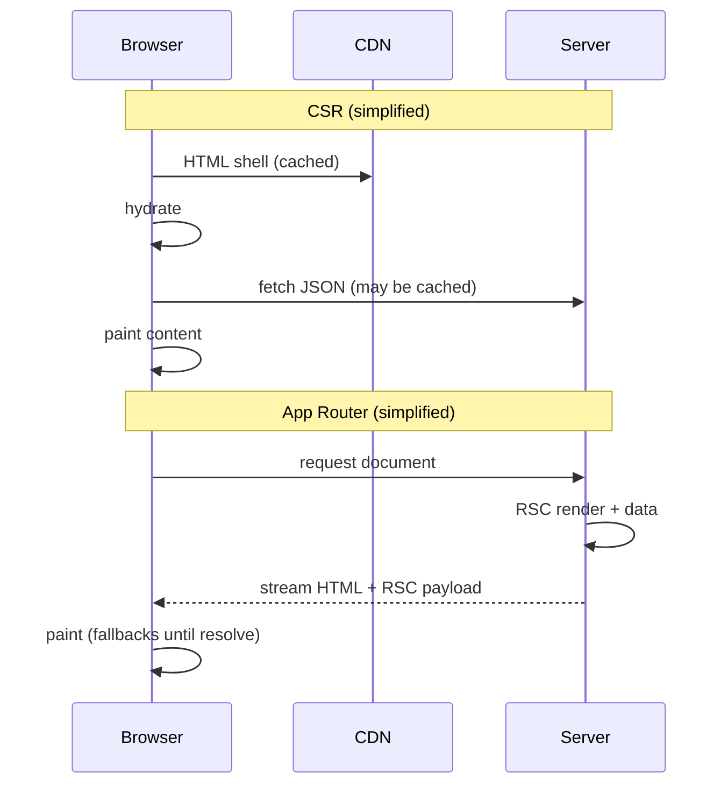

# Server cache and soft nav: what early App Router did not finish

## React Server Components

Before React Server Components (RSC), React mostly gave you two server-side modes.

- `renderToStaticMarkup` produced inert HTML that could not be hydrated, useful when React was only a static page generator.
- `renderToString`, paired with `hydrateRoot`, produced an interactive shell, but the browser still had to run the same tree again on the client.

The render pass itself was the limit. If a tree had to hydrate on the client, the same component model had to satisfy both environments. You could not freely reach for server APIs like the filesystem or a private database query inside that tree, and you could not freely use `window` or `document` either unless you pushed that code into effects or event handlers. In other words, the server/client boundary wrapped the whole tree instead of running through it.

> All Components, were Client Components.

This shaped how data reached the React render that produced the HTML. If you wanted server-side data fetching or private implementation details to contribute to that render, the work usually had to live outside the tree in loaders like `getStaticProps`, `getServerSideProps`, or framework-specific fetch layers, then come back in as serialized props for the component tree to deserialize and consume.

> Or you skipped server render and let a CSR app boot from an empty shell, then fetch and render after JavaScript loaded. That avoids the shared-tree restriction by keeping everything client-side, but now first paint, data fetching, and navigation all depend on the browser runtime.

RSCs change that by letting the boundary run through the tree itself. Server Components can keep server-only data fetching and private implementation details where they are used, then React renders that Server Component tree to an `RSC payload`, a serialized tree with references where Client Components take over. The framework combines that with Client Component output and streams HTML to the browser.

The client still receives the `RSC payload` and the bundles for Client Components so it can hydrate and continue the interactive parts. What it no longer needs is the JavaScript implementation of every component, or a public data layer just to reconstruct the first render. Painting can start from the HTML stream before all that JavaScript finishes loading.

<details>
<summary>RSC and the browser pixel pipeline</summary>

In a CSR app, getting something on screen often walks the full [pixel pipeline](https://web.dev/articles/rendering-performance): JavaScript, style, layout, paint, composite. The browser does that work on the client before the page feels settled.

RSC moves more of that work to the server. First paint can use streamed HTML while the browser only pays the client-side cost where interactivity actually lives.

[Rendering on the web](https://web.dev/articles/rendering-on-the-web) covers the surrounding models: SSR sends HTML instead of a large JS bootstrap, streaming can ship a shell before slow data resolves, and hydration attaches behavior later. RSC uses a different wire format, but the performance story rhymes with SSR and smaller client bundles.

</details>

## App Router and RSC

App Router is how most teams ship RSC. Unlike Pages Router, where a file under `pages/` was usually the whole page and shared chrome lived in `_app`, routing under `app/` shifts to composed segments. Each folder contributes part of the URL, the UI, and how that slice is cached.

In `app/`, each segment can export:

- `layout.tsx`, shared UI that persists across navigation within that subtree (not only a global `_app`).
- `page.tsx`, the leaf UI for that segment’s URL.
- Segment config (`dynamic`, `revalidate`, …) colocated with that slice of the tree.
- Nested folders for nested layouts and URLs.
- Parallel routes and interceptors when one URL needs multiple coordinated views.
- `route.ts`, an HTTP handler that bypasses the React renderer.

What you render for a URL is not one file. It is every `layout.tsx` above the segment, the `page.tsx` at that path, and any parallel or intercepted slots. A sibling `route.ts` is a different thing: HTTP only, no UI in that composition.

For example:

```txt
app/
  blog/
    layout.tsx      # shared chrome for /blog/*
    [slug]/
      page.tsx      # post at /blog/[slug]
    route.ts        # optional handlers, no page UI
```

`/blog/my-post` is `blog/layout.tsx` plus `[slug]/page.tsx`, not the page file in isolation. `blog/route.ts` might accept a webhook without entering the RSC tree.

<details>
<summary>Why page, layout, and route.ts?</summary>

That composition is why the file names feel overloaded at first: you are naming parts of an endpoint, not picking a single “page component” like `pages/blog/[slug].tsx`.

The `route.ts` convention is an escape hatch when you only need HTTP, not JSX. You cannot put `page.tsx` and `route.ts` in the same segment: Next expects either a rendered page or a handler, not both.

</details>

### Why CSR still felt simpler

Layouts, Server Components, and streaming landed in the same package. New tools, new ideas, and a caching model you had to learn before the app felt powerful. Segment `dynamic`, `fetch` cache flags, and Suspense were cope for static versus dynamic, not a coherent story on their own.

The split looked roughly like this:

```txt
CSR
  browser runtime
    data fetch
    client cache
    prefetch
    transition

Early App Router
  server render
    data fetch
    cache flags
    Suspense
  client router
    prefetch
    transition
```

**CSR.** Data fetching and soft navigation usually live in one runtime. Data work stays on the client: plain `fetch`, route loaders, or a library like SWR or React Query with its own cache and prefetch. Navigation stays there too: router prefetch, cached JSON or chunks, UI that can paint before everything is fresh.

**Early App Router.** It can do the same work, but it split it across many knobs: `dynamic` / `revalidate` on the segment, `cache` / `next.revalidate` on each `fetch`, Suspense to hide slow server work, prefetch depth that changed with static versus dynamic. A hybrid app meant combining all of them.

**Cache Components.** A [follow-up article](/blog/cache-components-a-paradigm-shift) covers how Cache Components use streaming, caching directives, PPR, and a few other techniques to solve these problems for App Router in a simpler, more declarative way.

## Server cache during render

Once data fetching moves into render, caching stops being only a client concern.

In a CSR app you ship a thin HTML shell, hydrate, then fetch in the tree. Some routes render nothing until data exists, so you never flash a skeleton you did not mean to show.

App Router moved that work into Server Components on the server. Colocation is good, but the timeline changed: a request hits the server, React walks the tree while `fetch` and database calls run with the components, and HTML streams back. Slow segments often show Suspense fallbacks while they resolve.

```tsx
// app/blog/[slug]/page.tsx
export default async function PostPage({
  params,
}: {
  params: Promise<{ slug: string }>;
}) {
  const { slug } = await params;
  const post = await getPost(slug);
  return <Article post={post} />;
}
```

When the whole page must not block on one slow call, you split boundaries:

```tsx
export default function PostPage({
  params,
}: {
  params: Promise<{ slug: string }>;
}) {
  return (
    <Suspense fallback={<PostSkeleton />}>
      <PostContent params={params} />
    </Suspense>
  );
}

async function PostContent({ params }: { params: Promise<{ slug: string }> }) {
  const { slug } = await params;
  const post = await getPost(slug);
  return <Article post={post} />;
}
```

CSR could hide loading by rendering no JSX until ready. App Router tends to show fallbacks unless you preload, prefetch, or lift fetches onto the server tree. Same tricks, different runtime.

Static versus live was declared in two places: segment config and per-`fetch` options.

```ts
export const dynamic = "force-static"; // or "force-dynamic"
export const revalidate = 3600;
```

```ts
await fetch("https://api.example.com/posts", {
  next: { revalidate: 60 },
});

await fetch("https://api.example.com/me", {
  cache: "no-store",
});
```

Build pre-rendered what could freeze. Dynamic routes tried to fetch fresh data as early as possible in the pass. It was easy to mark the wrong thing cached or live, and the fixes scattered across layouts, segment flags, and `fetch` options. That is the “too many knobs” problem in one place.

<details>
<summary>Browser cache vs server fetch during RSC render</summary>

In the browser, `fetch` sits on top of the HTTP cache (and your service worker, if you added one). `Cache-Control`, `ETag`, stale-while-revalidate: the platform already solved “reuse this response until it expires.”

Node’s built-in `fetch` (Undici) does not give you that stack for server-side renders. Work is moving on an [Undici HTTP cache interceptor](https://github.com/nodejs/undici/blob/main/docs/docs/api/CacheStore.md) (opt-in today), but even a faithful HTTP cache is not enough on its own.

App Router needed dedupe within one render pass, persistence across requests, tags and revalidation tied to mutations, and semantics aligned with static generation and segment boundaries. That is the Data Cache, Full Route Cache, `unstable_cache`, and the `next: { revalidate }` / `cache` options on `fetch`, not “turn on Node caching.”

RSC moved data work into the server render path. One navigation can trigger many `fetch` calls from different components in one tree walk.

Without a framework cache you repeat I/O, fight inconsistent snapshots, and cannot safely pre-render or reuse work. CSR left that to the browser cache and the client router. App Router had to rebuild an equivalent on the server because the render model moved.

</details>

## Soft navigation

Server cache decides whether the first paint has the right data. Soft navigation decides whether the next screen feels instant. CSR still wins on perception here.

SPAs won soft navigations with the History API, client routers, and prefetch: load JS or thin JSON for the next route before the click. Stale data could paint immediately. Only segments that had to be fresh waited on the network.

App Router added `<Link prefetch>` and payload-based client transitions. Static segments could reuse HTML from a prior render. Dynamic segments often started from a sparse shell and streamed the rest, which is correct but easy for users to read as “slow” when the outer shell was empty.

A CSR route could lazy-load a chunk and still feel instant because layout and placeholders were already in the shell. App Router transitions sometimes surfaced Suspense fallbacks you did not intend, especially when on-demand rendering started from blank chrome.

The workaround showed up everywhere: lift a fetch into a parent with unrelated concerns so I/O starts before a child suspends. It rhymes with lifting state, except the prize is server I/O and cache flags, not UI state.

```tsx
// parent warms cache so child suspends less
export default async function BlogLayout({ children }) {
  void getCategories();
  return (
    <Shell>
      <Sidebar categoriesPromise={getCategories()} />
      {children}
    </Shell>
  );
}
```

You should not need imperative glue to patch holes in the shell. Every app has a shell. On-demand rendering should not mean choosing between “empty until the stream catches up” and “frozen at build.”

<details>
<summary>What soft navigation prefetches (CSR vs App Router)</summary>

CSR routers usually prefetch JavaScript chunks or a loader payload (JSON) for the next URL. The client router owns when that runs. The browser may still cache those responses if the headers allow it.

App Router prefetch is the same shape as a normal document request: an RSC payload for the target URL. The client router stores that and applies it on `push`/`replace` so navigation can skip a round trip.

It is still HTTP. If the response is cacheable (`Cache-Control`, etc.), the browser can keep a copy too. Router cache for instant transitions. HTTP cache where headers allow.

Stale prefetches are the failure mode: you hovered a link, got a payload for build N, then navigated after deploy N+1.

[Skew protection](https://vercel.com/docs/skew-protection) pins prefetches and navigations to the deployment that served the page on Vercel. The router also tracks stale time on prefetch entries and refreshes them on navigation when needed. Without that you get correct-but-old UI or extra origin fetches, depending on timing.

CSR and App Router both prefetch ahead of the click. The payload changed (bundles/JSON vs RSC payload), and App Router ties prefetch depth to static vs dynamic segments and `loading.tsx` boundaries.

</details>

## One navigation, two stacks

Same user action (open a post), different choreography for server cache and soft navigation together:



In the CSR path, the shell often comes from a CDN, hydration runs, then client fetches (library cache or HTTP) before the page feels complete.

In the App Router path, render and data run on the server, then HTML and the RSC payload stream down. The user may see Suspense fallbacks until boundaries resolve.

Both stacks prefetch the next route early. App Router pushes more of cache policy and static/dynamic decisions onto the server. CSR keeps more of that in the browser runtime teams already debug.

## Static versus dynamic

This is where the earlier friction turns into policy. Most apps are hybrids: stable marketing, cookie-bound dashboards, on-demand writes. Segment `dynamic`, `fetch` cache flags, and Suspense were cope for that mixed reality.

Early App Router asked you to label a subtree fully static or fully dynamic, then optimize inside that label. Pre-render at build what could freeze. Pay a latency tax on demand when the outer shell could not be reused. Hide the tax with `loading.tsx`, Suspense trees, and lifted fetches.

That binary label is what made both server cache and soft navigation harder than CSR. You wanted subtree cache lifetime and prefetch with cookies and the full URL, not a single policy for every variant of a path.

<details>
<summary>Hybrid routes and Cache Components</summary>

Cache Components put cache lifetime on the subtree instead of the segment label.

`"use cache"` marks work the framework can retain. `cacheLife` and `cacheTag` say how long and when to invalidate. Runtime prefetch (with cookies, headers, and full URL) can pre-render what used to be “too dynamic to prefetch” without freezing the page at build.

```tsx
"use cache";

import { cacheLife, cacheTag } from "next/cache";

export async function getPost(slug: string) {
  cacheTag(slug);
  cacheLife("hours");
  // ...
}
```

That is the direction: static-to-dynamic as a spectrum, cache as part of the tree, soft navigation fed by runtime prerender instead of only build output.

</details>

If Pages Router felt snappy and App Router felt fallback-heavy after a migration, the friction was usually server cache during render and soft navigation, not RSC.

That is the problem statement behind Cache Components: move cache into the tree, relax the hard line between build time and request time, and let each URL sit on a spectrum instead of at one end. The [follow-up article](/blog/cache-components-a-paradigm-shift) develops that solution.
